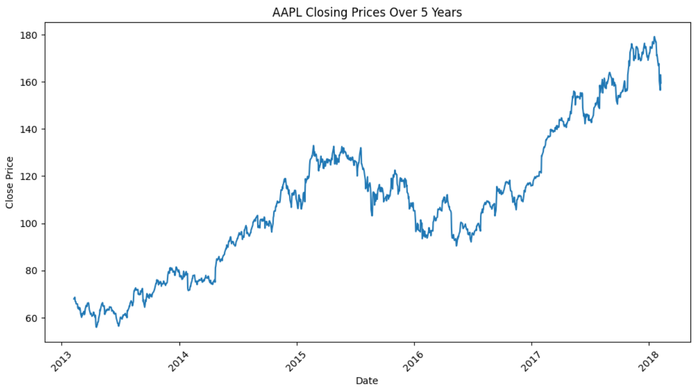
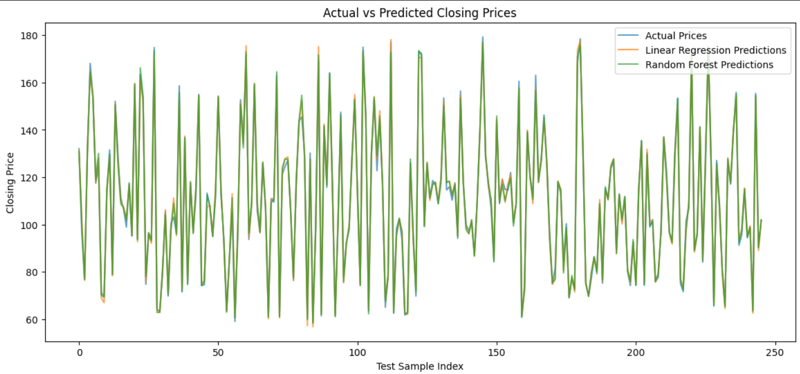
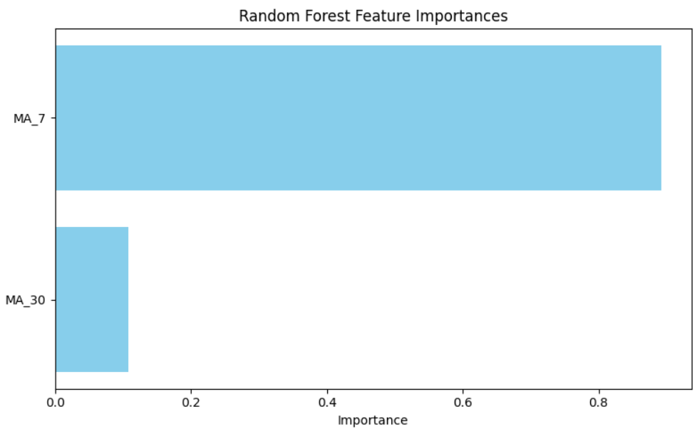
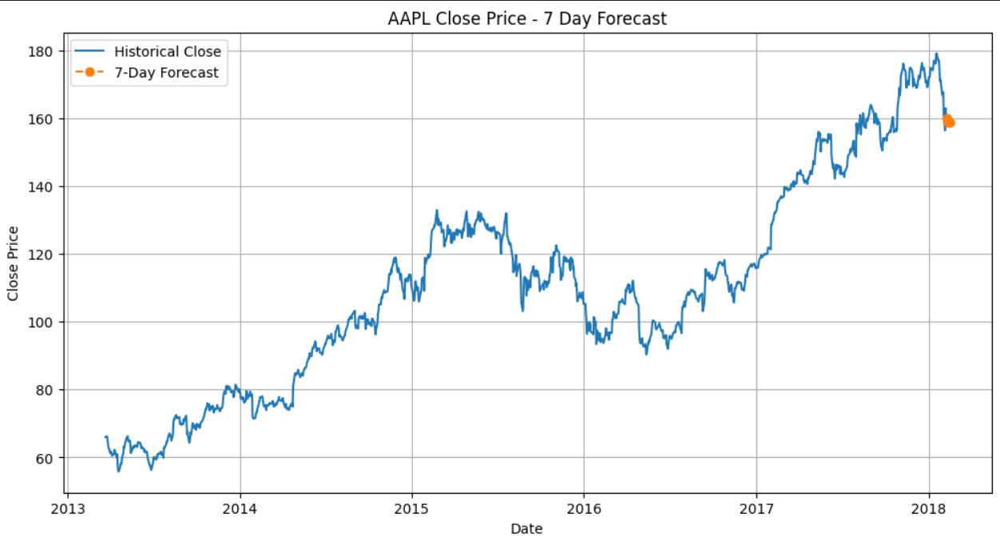
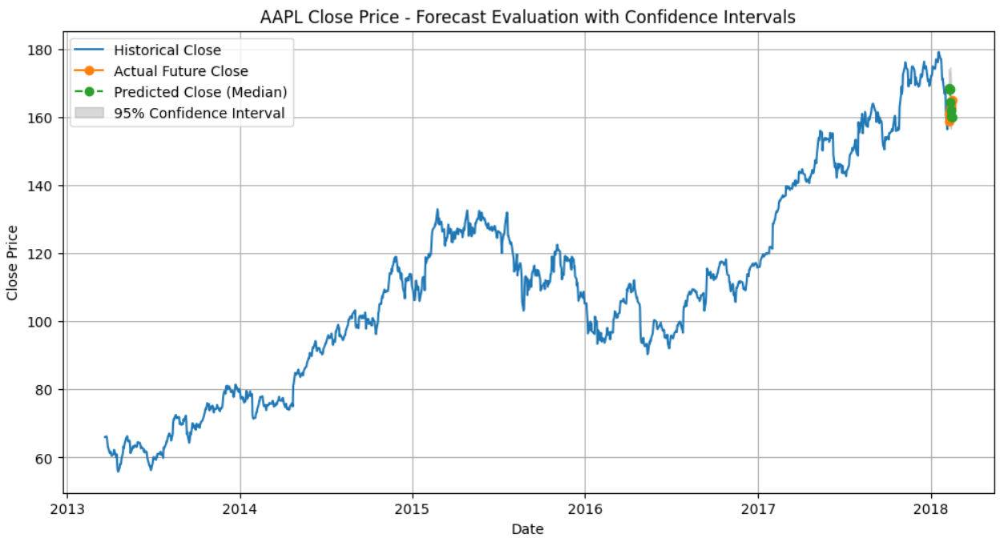

# 📈 stock-price-prediction

Predicting future stock prices using machine learning models and historical S&P 500 stock data.

---

## 🔍 Overview

This project explores machine learning approaches to forecast the next day's closing price for S&P 500 stocks. The notebook includes full preprocessing, feature engineering, model training, evaluation, and future forecasting.

- **Model Used:** Random Forest Regressor  
- **Dataset:** [S&P 500 Stock Data from Kaggle](https://www.kaggle.com/datasets/camnugent/sandp500)  
- **Goal:** Predict next-day closing price  
- **Performance Metric:** RMSE (Root Mean Squared Error)

---

## 🛠 Features and Workflow

1. **Data Loading & Cleaning** – Removed missing values, filtered relevant stock data (e.g., AAPL).
2. **Feature Engineering** – Added lag features, 7-day and 30-day moving averages.
3. **Model Training** – Trained Linear Regression, Support Vector Regression, Random Forest, and Gradient Boosting models.
4. **Data Visualization** – Visualized AAPL stock closing prices over the past 5 years.
5. **Prepare Data for Modeling** – Prepared the dataset by splitting features and target variable for model training.
6. **Model Building** – Trained different models (Random Forest, Linear Regression, etc.) on historical data.
7. **Model Evaluation** – Used RMSE, MAE, R² metrics to compare model accuracy.
8. **Model Comparison and Selection** – Compared performance metrics and selected the best model.
9. **Model Interpretation and Insights** – Analyzed feature importance from Random Forest model to interpret key drivers.
10. **Model Validation and Robustness Checks** – Validated model predictions using cross-validation and robust checks.
11. **Create Future Input Data** – Generated simulated future input data for stock forecasting.
12. **Evaluate and Interpret the Forecast** – Evaluated forecast performance using metrics like MAE and RMSE and visualized predictions.

---

## ✅ Final Results

- **Best Model:** Random Forest  
- **Best Parameters:** `max_depth=3`, `min_samples_split=10`, `n_estimators=10`  
- **Test RMSE:** `11.1352`  
- **Forecast RMSE (7-day):** `3.5490`

---

## 📊 Results, Insights, and Deliverables

### **Model Performance**

1. **Linear Regression:**
   - RMSE: `2.1059`
   - MAE: `1.5611`
   - R²: `0.9951`

2. **Random Forest:**
   - RMSE: `1.9045`
   - MAE: `1.3347`
   - R²: `0.9960`

The Random Forest model outperformed Linear Regression in terms of RMSE and MAE, with a slightly better R² score, making it the best choice for this stock prediction problem.

---

### **Key Insights**

- **Feature Importance:** The Random Forest model identified the **7-day moving average (MA_7)** as the most influential feature, followed closely by the **30-day moving average (MA_30)**. This suggests that short-term trends are more predictive of future closing prices than long-term trends.

- **Model Interpretation:** Advanced model interpretation techniques, like SHAP (SHapley Additive exPlanations), can further enhance the interpretability of the Random Forest model. Future improvements could include feature engineering with additional technical indicators like RSI (Relative Strength Index) or MACD (Moving Average Convergence Divergence).

- **Forecasting Accuracy:** The forecasted values for the next 7 days were quite close to the actual values (with an RMSE of 3.5490), which suggests that the model has good predictive power.

---

## 🖼 Key Visualizations
**Visualization** – Saved performance and forecast charts to `images/` folder.

- 📉 **AAPL Closing Prices Over 5 Years**  
  

- 📊 **Predicted vs Actual Close Prices**  
  

- 🪄 **Feature Importance from Random Forest**  
  

- 🔮 **7-Day Price Forecast**  
  

- 📈 **Forecast Evaluation**  
  

---
## 📓 Running the Notebook

Open and run the notebook `stock_forecasting.ipynb` to explore the data, model training, evaluation, and forecasting process step by step.

## 📁 Project Structure

```text
stock-price-prediction/
│
├── data/
│   └── all_stocks_5yr.csv
├── images/
│   ├── AAPL_closing_Over_5years_prices.png
│   ├── predicted_vs_actual.png
│   ├── feature_importance.png
│   ├── 7Days_forecast.png
│   └── forecast_eval.png
├── stock_forecasting.ipynb
├── .gitignore   
├── README.md
└── requirements.txt

---

## 📦 Dependencies

- Python 3.x
- pandas
- numpy
- scikit-learn
- matplotlib
- seaborn
- joblib

Install using:

```bash
pip install -r requirements.txt
```
# 📚 References

- S&P 500 Dataset on [Kaggle](https://www.kaggle.com/datasets/camnugent/sandp500)
- [Scikit-learn Documentation](https://scikit-learn.org/stable/)
- [Pandas Documentation](https://pandas.pydata.org/docs/)
- [Matplotlib](https://matplotlib.org/)
- [Seaborn](https://seaborn.pydata.org/)
- Tesfai, E. (2025). *S&P 500 Stock Price Prediction Project*. Retrieved from [https://github.com/Elen-tesfai/stock-price-prediction](https://github.com/Elen-tesfai/stock-price-prediction)

---

## 🧠 Author

**Elen Resfai**  
📍 Data Science enthusiast passionate about forecasting and applied machine learning.